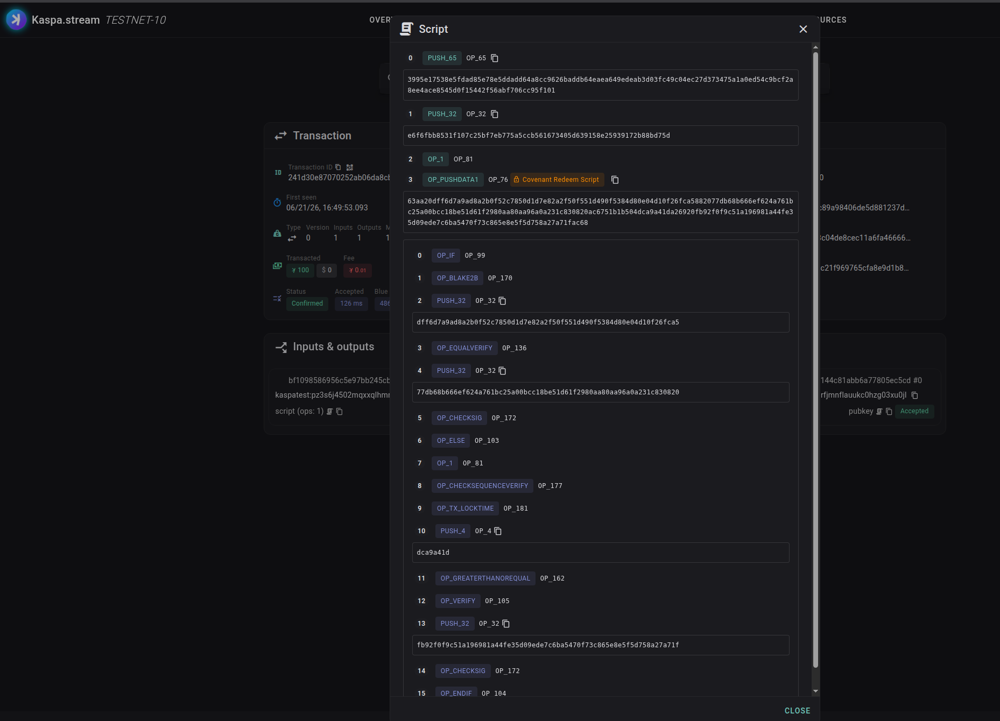

# HTLC Atomic Swaps on Kaspa

A Hash Time-Locked Contract is the smallest piece that makes a trustless swap work:
funds locked to a script with two mutually exclusive spend paths.

- **Claim** — reveal a secret `s` where `blake2b(s) == H`, plus the claimant's signature.
  Available immediately. Spending this path writes `s` onto the ledger in plain sight.
- **Refund** — the funder's signature, but only after a timeout DAA has passed.
  The safety valve if the swap never completes.

This is the KAS leg of a cross-chain swap and the foundation of non-custodial orders.
Everything here reuses machinery proven elsewhere in this repo; the only new mechanic is
the hashlock (`OpBlake2b` + `OpEqualVerify`), and blake2b is the same hash behind every
P2SH address.

## The redeem script (116 bytes)

```
OpIf                                         # selector: 1 = claim, 0 = refund
    OpBlake2b  <H>  OpEqualVerify            #   hashlock: blake2b(preimage) == H
    <taker_xonly>  OpCheckSig                #   taker signature
OpElse
    Op1  OpCheckSequenceVerify               #   force non-final sequence (so lock_time binds)
    OpTxLockTime  <timeout>  OpGreaterThanOrEqual  OpVerify   # tx.lock_time >= timeout
    <maker_xonly>  OpCheckSig                #   maker signature
OpEndIf
```

No state is prepended, so the witness items land on the stack in the right order with no
re-rolling. The claim witness is `[taker_sig, preimage, 1]`; the refund witness is
`[maker_sig, 0]`. Each branch ends on `OpCheckSig`, leaving a single boolean for the P2SH
check.

The timeout is enforced without the `OpCheckLockTimeVerify` opcode: `OpTxLockTime` reads the
transaction's lock time, we compare it against the timeout directly, and `Op1
OpCheckSequenceVerify` forces the input non-final so consensus actually enforces the lock
time (a final input ignores it). The spender sets `lock_time = currentDAA - 200`, which the
script checks is `>= timeout` — so the refund path only opens once the timeout DAA is
behind us.

## Proven on testnet-10

| Path   | What it exercises                                    | Result    | Tx |
|--------|------------------------------------------------------|-----------|----|
| Claim  | hashlock (`OpBlake2b` == `H`) + taker signature      | confirmed | `241d30e87070252ab06da8cb0d053630f60b9350b64144c81abb6a77805ec5cd` |
| Refund | `OpTxLockTime >= timeout` + CSV non-finality + maker sig | confirmed | `0c96dbd1f220eedaa1734ce85a2cf2fcbe22bcd0023101fee5771ccec393dd73` |

Open the claim transaction's input on an explorer and you can read the revealed secret
directly in the signature script. That on-chain reveal is the swap's atomicity: the
counterparty watching the mirror leg extracts the secret and claims, and neither side can
take both legs.

## On-chain anatomy of a claim

The claim transaction
`241d30e87070252ab06da8cb0d053630f60b9350b64144c81abb6a77805ec5cd` decodes on
[kaspa.stream](https://kaspa.stream) into exactly the script built above. Confirmed in
126 ms; one input from the HTLC address, one output to the taker.



**The signature script (the witness that unlocks the funds):**

| # | Op | Data | What it is |
|---|----|------|------------|
| 0 | `PUSH_65` | `3995e175…95f101` | taker's Schnorr signature + `01` sighash byte |
| 1 | `PUSH_32` | `e6f6fbb8531f107c…b88bd75d` | **the revealed secret `s`** |
| 2 | `OP_1` | | selector: take the claim branch |
| 3 | `OP_PUSHDATA1` | *(116 bytes, tagged "Covenant Redeem Script")* | the redeem itself |

Item 1 is the whole point. The preimage that was hidden behind `H` is now permanent,
public ledger data. A counterparty watching the mirror leg reads it straight off this
field and sweeps their side — that is the atomicity, made visible.

**The redeem script the explorer expands from item 3:**

| # | Op | Data | Role |
|---|----|------|------|
| 0 | `OP_IF` | | branch on the selector |
| 1 | `OP_BLAKE2B` | | hash the revealed preimage |
| 2 | `PUSH_32` | `dff6d7a9ad…26fca5` | `H`, the hashlock target |
| 3 | `OP_EQUALVERIFY` | | require `blake2b(s) == H` |
| 4 | `PUSH_32` | `77db68b6…c830820` | taker x-only pubkey |
| 5 | `OP_CHECKSIG` | | require the taker's signature |
| 6 | `OP_ELSE` | | refund branch |
| 7–8 | `OP_1` `OP_CHECKSEQUENCEVERIFY` | | force the input non-final so lock_time binds |
| 9 | `OP_TX_LOCKTIME` | | read the transaction's lock time |
| 10 | `PUSH_4` | `dca9a41d` | timeout = `0x1da4a9dc` = **497,330,652** (DAA) |
| 11–12 | `OP_GREATERTHANOREQUAL` `OP_VERIFY` | | require `lock_time >= timeout` |
| 13 | `PUSH_32` | `fb92f0f9…8a27a71f` | maker x-only pubkey |
| 14 | `OP_CHECKSIG` | | require the maker's signature |
| 15 | `OP_ENDIF` | | |

Two things to notice. The hashlock target at op 2 matches the `H` this HTLC was funded
under, and `OP_BLAKE2B` ran on the revealed secret and matched it at consensus — the one
mechanic that had never been exercised on-chain before this transaction. And op 10's
`PUSH_4 dca9a41d` is the timeout in minimal little-endian encoding, decoding to the exact
DAA score the lock command printed. The explorer naming these by their Toccata opcodes
(`OP_BLAKE2B`, `OP_TX_LOCKTIME`, `OP_CHECKSEQUENCEVERIFY`) is independent confirmation that
the covenant-introspection opcode set is live on testnet-10.

## How it composes into a swap

Two parties lock mirror HTLCs on two chains with the **same** `H`, the taker's timeout
**shorter** than the maker's:

1. Maker picks secret `s`, computes `H = blake2b(s)`, locks leg A (claimable by the taker
   with `s`, refundable by the maker after `T_A`).
2. Taker locks leg B with the same `H` (claimable by the maker with `s`, refundable by the
   taker after `T_B < T_A`).
3. Maker claims leg B by revealing `s`. Now `s` is public.
4. Taker reads `s` from leg B and claims leg A.

If either side stalls, the refund paths return funds after the timeouts. The shorter taker
timeout guarantees the maker always has time to react to a revealed secret.

## From swap to order

The bare HTLC is non-custodial but unpriced. The introspection constraints proven in the
budget covenant (`covenant/`) — exact-amount and exact-recipient output checks — turn it
into a fee-bearing **order**: require the claim transaction to also pay a protocol fee to a
fixed address, exactly the dev-fee pattern. Combined with the native KRC-20 tokens that
arrive at the Toccata mainnet activation, that becomes a real on-chain limit order: lock a
token, let anyone fill it by paying the asking price in KAS, with the protocol fee enforced
at consensus rather than by an indexer or a custodian.

## Running it

```
python3 kaspa_htlc_swap.py lock --amount-tkas 5 --timeout-daa 600   # build + show the HTLC
python3 kaspa_htlc_swap.py info                                     # balance + claim/refund window
python3 kaspa_htlc_swap.py claim  <payout_address>                  # reveal the secret, sweep
python3 kaspa_htlc_swap.py refund <payout_address>                  # reclaim after timeout
```

`lock` generates the maker key, taker key, and a random secret, and saves them to
`htlc_swap_config.json` (gitignored — it holds private keys). For a BTC-compatible
cross-chain swap, switch the hashlock opcode from `OpBlake2b` to `OpSHA256` so both legs
share SHA-256.

> Unaudited research code on a testnet. Use at your own risk.
